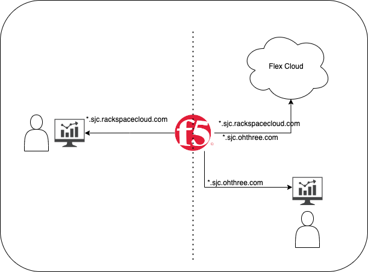

## Gateway API

Gateway API is L4 and L7 layer routing project in Kubernetes. It represents next generation of k8s Ingress, LB and Service Mesh APIs. For more information on the project see: [Gateway API SIG.](https://gateway-api.sigs.k8s.io/)

**Move from Ingress to Gateway APIs**
Since Gateway APIs are successor to Ingress Controllers there needs to be a one time migration from Ingress -> GW API resources. To learn more about it refer to: [Ingress Migration](https://gateway-api.sigs.k8s.io/guides/migrating-from-ingress/#migrating-from-ingress)


### Resource Models in Gateway API
There are 3 main resource models in gateway apis:
1. GatewayClass - Mostly managed by a controller.
2. Gateway - An instance of traffic handling infra like a LB.
3. Routes - Defines HTTP-specific rules for mapping traffic from a Gateway listener to a representation of backend network endpoints.

**k8s Gateway API is NOT the same as API Gateways**
While both sound the same, API Gateway is a more of a general concept that defines a set of resources that exposes capabilities of a backend service but also provide other functionalities like traffic management, rate limiting, authentication and more. It is geared towards commercial API management and monetisation.

From the gateway api sig:

!!! note

    Most Gateway API implementations are API Gateways to some extent, but not all API Gateways are Gateway API implementations.


### Controller: NGINX Gateway Fabric
[NGINX Gateway Fabric](https://github.com/nginxinc/nginx-gateway-fabric) is an open-source project that provides an implementation of the Gateway API using nginx as the data plane.

Chart Install: https://github.com/nginxinc/nginx-gateway-fabric/blob/main/deploy/helm-chart/values.yaml

Create the Namespace
```
kubectl create ns nginx-gateway
```

First Install the Gateway API Resource from Kubernetes
```
kubectl apply -f https://github.com/kubernetes-sigs/gateway-api/releases/download/v1.0.0/standard-install.yaml
```

Next, Install the NGINX Gateway Fabric controller
```
cd /opt/genestack/submodules/nginx-gateway-fabric/deploy/helm-chart

helm upgrade --install nginx-gateway-fabric . --namespace=nginx-gateway -f /opt/genestack/helm-configs/nginx-gateway-fabric/helm-overrides.yaml
```

Helm install does not automatically upgrade the crds for this resource. To upgrade the crds you will have to manually install them. Follow the process from :  [Upgrade CRDs](https://docs.nginx.com/nginx-gateway-fabric/installation/installing-ngf/helm/#upgrade-nginx-gateway-fabric-crds)

### Example Implementation with Prometheus UI

In this example we will look at how Prometheus UI is exposed through the gateway. For other services the gateway kustomization file for the service.

Rackspace specific gateway kustomization files can be applied like so
```
cd /opt/genestack/kustomize/gateway
kubectl kustomize | kubectl apply -f -
```

First, create the shared gateway and then the httproute resource for prometheus.
```
apiVersion: gateway.networking.k8s.io/v1
kind: Gateway
metadata:
  name: flex-gateway
spec:
  gatewayClassName: nginx
  listeners:
  - name: http
    port: 80
    protocol: HTTP
    hostname: "*.sjc.ohthree.com"
```

then

```
apiVersion: gateway.networking.k8s.io/v1
kind: HTTPRoute
metadata:
  name: prometheus-gateway-route
spec:
  parentRefs:
  - name: flex-gateway
    sectionName: http
  hostnames:
  - "prometheus.sjc.ohthree.com"
  rules:
    - backendRefs:
      - name: kube-prometheus-stack-prometheus
        port: 9090
```
At this point, flex-gateway has a listener pointed to the port 80 matching *.sjc.ohthree.com hostname. The HTTPRoute resource configures routes for this gateway. Here, we match all path and simply pass any request from the matching hostname to kube-prometheus-stack-prometheus backend service.

### Exposing Flex Services

We have a requirement to expose a service

 1. Internally for private consumption (Management and Administrative Services)
 2. Externally to customers (mostly Openstack services)



For each externally exposed service, example: keystone endpoint, we have a GatewayAPI resource setup to use listeners on services with matching rules based on hostname, for example keystone.sjc.api.rackspacecloud.com. When a request comes in to the f5 vip for this the vip is setup to pass the traffic to the Metallb external vip address. Metallb then forwards the traffic to the appropriate service endpoint for the gateway controller which matches the hostname and passes the traffic onto the right service. The same applies to internal services. Anything that matches ohthree.com hostname can be considered internal and handled accordingly.

```
External Traffic -> F5 VIP Address -> MetalLB VIP Address -> Gateway Service

```

This setup can be expended to have multiple MetalLB VIPs with multiple Gateway Services listening on different IP addresses as required by your setup.

!!! tip

    The metalLB speaker wont advertise the service if :

    1. There is no active endpoint backing the service

    2. There are no matching L2 or BGP speaker nodes

    3. If the service has external Traffic Policy set to local you need to have the running endpoint on the speaker node.


### Cross Namespace Routing

Gateway API has support for multi-ns and cross namespace routing. Routes can be deployed into different Namespaces and Routes can attach to Gateways across Namespace boundaries. This allows user access control to be applied differently across Namespaces for Routes and Gateways, effectively segmenting access and control to different parts of the cluster-wide routing configuration.

See: https://gateway-api.sigs.k8s.io/guides/multiple-ns/ for more information on cross namespace routing.
