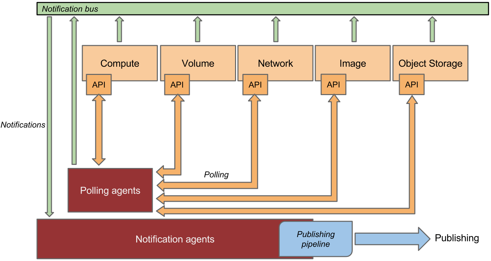

# Ceilometer (Metering and Event Collection)

Ceilometer is the telemetry service in OpenStack responsible for collecting
usage data related to different resources (_e.g., instances, volumes,
and network usage_). It compiles various types of metrics (_referred to as
meters_), such as CPU utilization, disk I/O, and network traffic. It does 
this by gathering data from other OpenStack components like Nova (_compute_), 
Cinder (_block storage_), and Neutron (_networking_). It also captures event 
data such as instance creation and volume attachment via hooks into the message
notification system (_RabbitMQ_).



<figure>
   <figcaption>Image source: <a href="https://docs.openstack.org/ceilometer/latest/contributor/architecture.html" target="_blank" rel="noopener noreferrer">docs.openstack.org</a></figcaption>
</figure>

## Configuration

Ceilometer’s configuration may initially seem complex due to the extensive
number of event, metric, and resource definitions available. However, these
definitions can be easily modified to adjust the data collected by the polling
and notification agents, allowing users to fine-tune data collection based on
their specific needs.

### Events

Events are discrete occurrences, such as the starting or stopping of
instances or attaching a volume which are captured and stored. Ceilometer
builds event data from the messages it receives from other OpenStack 
services. Event definitions can be complex. Typically, a given message will
match one or more event definitions that describe what the incoming payload
should be flattened to. See the [telemetry-events][ceilometer-events]
section of Ceilometer's documentation for more information.

??? example "Example event definitions for cinder volumes"

    ```
    - event_type: ['volume.exists', 'volume.retype', 'volume.create.*', 'volume.delete.*', 'volume.resize.*', 'volume.attach.*', 'volume.detach.*', 'volume.update.*', 'snapshot.exists', 'snapshot.create.*', 'snapshot.delete.*', 'snapshot.update.*', 'volume.transfer.accept.end', 'snapshot.transfer.accept.end']
      traits: &cinder_traits
        user_id:
          fields: payload.user_id
        project_id:
          fields: payload.tenant_id
        availability_zone:
          fields: payload.availability_zone
        display_name:
          fields: payload.display_name
        replication_status:
          fields: payload.replication_status
        status:
          fields: payload.status
        created_at:
          type: datetime
          fields: payload.created_at
        image_id:
          fields: payload.glance_metadata[?key=image_id].value
        instance_id:
          fields: payload.volume_attachment[0].instance_uuid
    - event_type: ['volume.transfer.*', 'volume.exists', 'volume.retype', 'volume.create.*', 'volume.delete.*', 'volume.resize.*', 'volume.attach.*', 'volume.detach.*', 'volume.update.*', 'snapshot.transfer.accept.end']
      traits:
        <<: *cinder_traits
        resource_id:
          fields: payload.volume_id
        host:
          fields: payload.host
        size:
          type: int
          fields: payload.size
        type:
          fields: payload.volume_type
        replication_status:
          fields: payload.replication_status
    ```

### Resources

Gnocchi resource definitions in Ceilometer's configuration define how resources 
like instances, volumes, and networks are represented and tracked for 
telemetry purposes. Each definition specifies the attributes (_such as project 
ID or instance name_) and the metrics (_like CPU usage or network traffic_)
associated with that resource. When Ceilometer collects data from various
OpenStack services, it uses these definitions to map the data to the appropriate
resource type in Gnocchi (_which stores it as time-series data_). This 
structure allows for efficient monitoring, aggregation, and analysis of resource
usage over time in a scalable way.

??? example "Example resource definition for cinder volumes"

    ```
    - resource_type: volume
      metrics:
        volume:
        volume.size:
        snapshot.size:
        volume.snapshot.size:
        volume.backup.size:
        backup.size:
        volume.manage_existing.start:
        volume.manage_existing.end:
        volume.manage_existing_snapshot.start:
        volume.manage_existing_snapshot.end:
      attributes:
        display_name: resource_metadata.(display_name|name)
        volume_type: resource_metadata.volume_type
        image_id: resource_metadata.image_id
        instance_id: resource_metadata.instance_id
      event_create:
        - volume.create.end
      event_delete:
        - volume.delete.end
        - snapshot.delete.end
      event_update:
        - volume.attach.end
        - volume.transfer.accept.end
        - snapshot.transfer.accept.end
      event_attributes:
        id: resource_id
        project_id: project_id
        image_id: image_id
        instance_id: instance_id
    ```

### Meters

Meters are quantitative measures like CPU time, memory usage, or disk 
operations. Ceilometer provides several useful metrics by default, but new 
definitions can be added to suit almost every need. To read more about
measurements and how they are captured, see the [telemetry-measurements][ceilometer-telemetry]
section of Ceilometer documentation.

??? example "Example metric definition for volume.size"
    ```
    - name: 'volume.size'
    event_type:
      - 'volume.exists'
      - 'volume.retype'
      - 'volume.create.*'
      - 'volume.delete.*'
      - 'volume.resize.*'
      - 'volume.attach.*'
      - 'volume.detach.*'
      - 'volume.update.*'
      - 'volume.manage.*'
    type: 'gauge'
    unit: 'GB'
    volume: $.payload.size
    user_id: $.payload.user_id
    project_id: $.payload.tenant_id
    resource_id: $.payload.volume_id
    metadata:
      display_name: $.payload.display_name
      volume_type: $.payload.volume_type
      image_id: $.payload.glance_metadata[?key=image_id].value
      instance_id: $.payload.volume_attachment[0].instance_uuid
    ```

[ceilometer-telemetry]: https://docs.openstack.org/ceilometer/latest/admin/telemetry-measurements.html "The Telemetry service collects meters within an OpenStack deployment. This section provides a brief summary about meters format, their origin, and also contains the list of available meters."

[ceilometer-events]: https://docs.openstack.org/ceilometer/latest/admin/telemetry-events.html "In addition to meters, the Telemetry service collects events triggered within an OpenStack environment. This section provides a brief summary of the events format in the Telemetry service."
