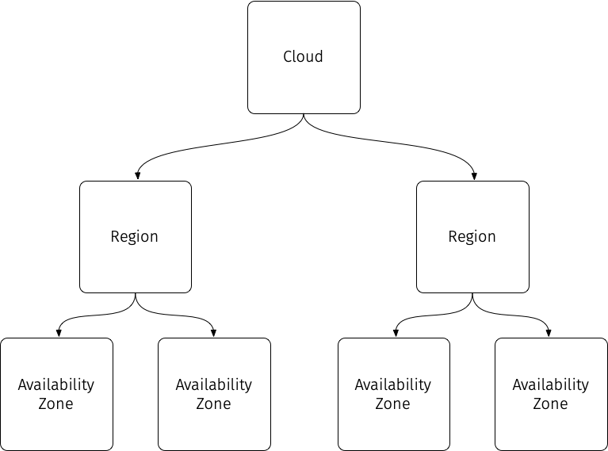

# Overview

When building a cloud, the design of the cloud will not only reflect the type of services you are looking to provide but also inform the way that users of your cloud work to accomplish their goals.

Availability is one of the key aspects of deploying applications in the cloud.  Whether you are building a [twelve-factor](https://12factor.net/){:target="_blank"} cloud-native application or running a more traditional stateful application,  in order for an application to maximize availability, it needs to have resiliance against failures, and that means understanding what failure domains the cloud infrastructure has.

As the cloud designer and builder, providing the capabilities for high-availability means effectively defining your cloud structure for users to work around these failure domains.  Depending on the resources you have or wish to make availabile to your users, you should decide how to set up the topology and architecture of your cloud to enable users to plan their deployments to maximize the availabilty of their applications.  This clould topology consists of the hierarchy of organizational units of your cloud and decide how your services function across them.  Examples of these organizational units include:

- Clouds
- Regions
- Availability Zones

These are typically arranged as in a hierarchy, with each incresing lower layer becoming less independent of the other layers:

# Clouds

At the highest level, a cloud is a  unique set of services that  operates completely independedntly.  We can define a cloud as having its own set of resources and services that are not dependent on any other cloud.

Having multiple clouds gives you the most coarse-grained failure domain organization possible.  There are several advantages to having multiple clouds:

- Complete operational independence, meaning no cross-dependencies with one another
- Each cloud does not have to offer the same set of services as the others
- Each cloud can be at a different software version or release from the others
- Cloud operations for one cloud is completely independent from the others

For your users, it means that ultimately if there is any kind of failure for _Cloud A_ then this would have no effect at all in _Cloud B_.

While simplistic, this is an entirely valid design pattern.  If there is a need to deploy several locations that are (mostly[^1]) independent, then this pattern works very well.  Each cloud can operate completely independently of one another, and maintenance or downtime of one cloud or a service in one cloud has no effect on the other clouds.

The major disadvantage of this pattern is that any replication of data or services between clouds is the responsibility of your users, and any shared services that your users want to use across multiple clouds will have to be external to the clouds they want to use.

# Regions

Regions can be defined as a high-level cloud construct where there is some sort of geographical separation of services.  In most cases, there may be some supporting services are shared between them; however, the general principle is that each region should be as self-sufficient as possible.

Depending on the scale of the cloud being built, geographical separation could be completely separate datacenters for very large clouds, or it could just mean separate data halls for smaller clouds.  Regardless of the scale of separation, the operational resources should be kept as independent as possible with respect to power, networking, cooling, etc.

In addition to the physical geographical separation, there also needs to be logical separation of most services.  Most storage, compute, and execution services[^2] should be separate and have the ability to operate independently from those same services deployed in other regions.  This is key to ensure that users can depend on any region-level failure to be isolated and not bleed into other regions and harm the availability of their deployments.  Any kind of fault or failure at the Region-level should be able to be mitigated by the cloud user having deployments in mulitple regions to provide high-availability.

# Availability Zones

Availability Zones are another logical grouping for sets of closely related resources and servces. In a large-scale cloud, an Availability Zone may comprise of multiple datacenters.  For smaller clouds, they may be more modest in scale such as a data hall or even as small as row of racks.  Ultimately, Availability Zones are rather arbitrary -- they essentially are a way to classify a cloud "failure domain" in less severe language.

Generally, no two Availability zones share the same core set of compute and storage resources.  Each availabilty zone is able to operate self-sufficiently and operation should be as self-contained and physically isolated from other Availability Zones as possible  in the same region to provide additional fault tolerance and resiliency.

[^1]:
    The various clouds themselves should be completely independent, but they might rely on a shared backend service like LDAP for authentication.

[^2]:
    This could be containers, container orchestration, such as [Kubernetes](https://kubernetes.io){:target="_blank"} or fuctions-as-a-service (FaaS) capabilities.
